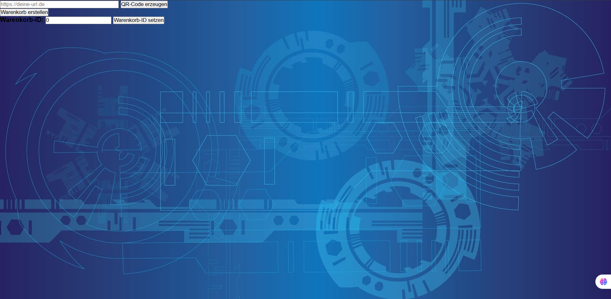
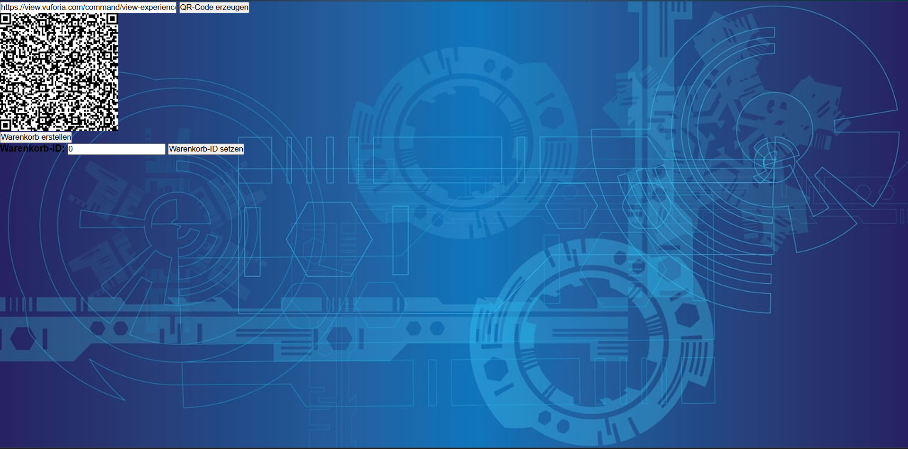
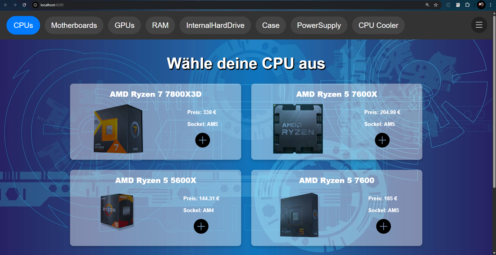
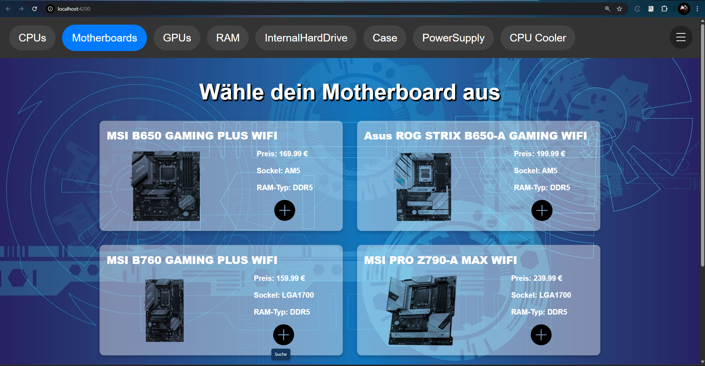
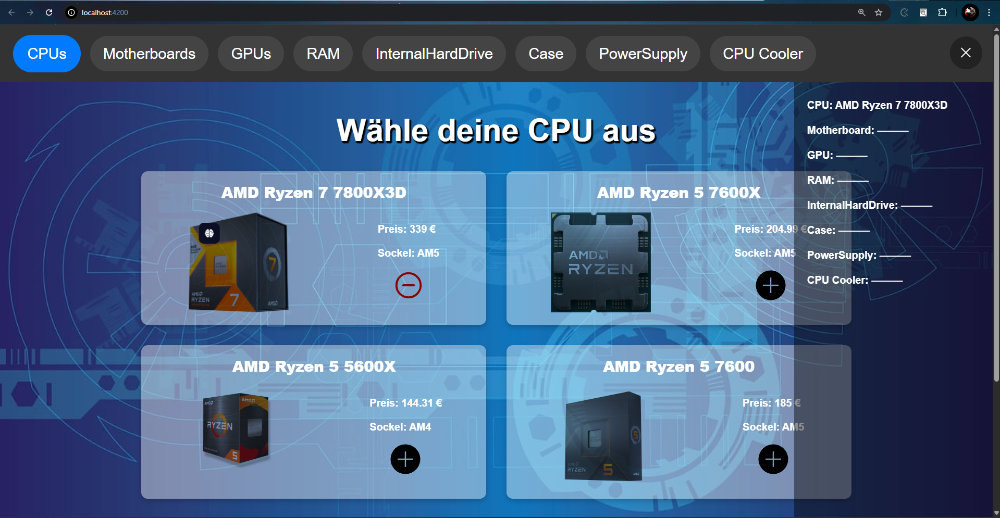
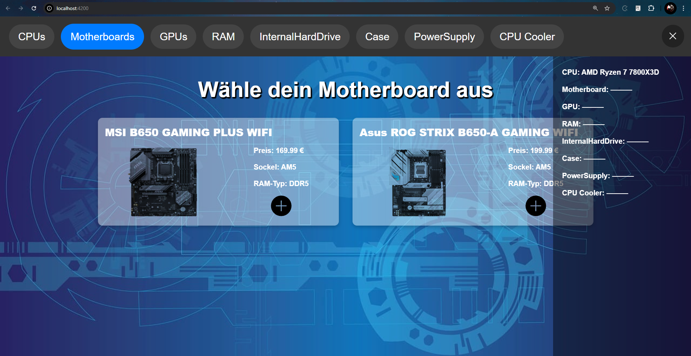

# 📦 Projekt: Computer3DConfigurator – Motivation & Übersicht

## 🧠 Ziel des Projekts

Der **Computer3DConfigurator** ist eine interaktive Anwendung, mit der Benutzer*innen ihren individuellen PC in Echtzeit zusammenstellen und als 3D-Modell betrachten können. Das Ziel ist es, die **Kompatibilität und visuelle Harmonie** der ausgewählten Komponenten zu überprüfen – **bevor** sie gekauft werden.

## 🎯 Warum dieses Projekt?

- **Fehlkäufe vermeiden:** Viele Komponenten sind mechanisch oder visuell nicht kompatibel.
- **Kaufentscheidung verbessern:** Nutzer*innen können sehen, wie der PC am Ende aussieht.
- **Innovation in der PC-Konfiguration:** Marktübliche Tools bieten meist nur technische Filter ohne visuelle Vorschau.

---

## 🧱 3D-Objekte & CAD-Beitrag

Damit der Konfigurator funktioniert, benötigen wir **detaillierte 3D-Modelle** von PC-Komponenten. Eure Aufgabe ist es, uns mit diesen Modellen zu unterstützen.

### 🎨 Benötigte Komponenten (erste Priorität)

- Mainboards
- CPUs
- CPU-Kühler
- RAM-Module
- Grafikkarten
- Powersupply
- Gehäuse
- Gehäusekühler
### 📐 Anforderungen an die 3D-Modelle

- **Format:** vorzugsweise `.pvz` (Vuforia View-kompatibel), alternativ `.glb` oder `.fbx` für Konvertierung
- **Keine Logos/Marken**, wenn möglich (wegen Lizenzierung)

---

## 🔄 Integration & Anwendung

- Die 3D-Modelle werden in **Vuforia Studio** eingebunden.
- Benutzer*innen können über einen **QR-Code auf unserer Website** die AR-Ansicht starten.
- Die Darstellung erfolgt über die **Vuforia View App**, wahlweise auf Mobilgeräten oder HoloLens.
- Fokus liegt auf der **visuellen Präsentation** und dem **räumlichen Eindruck** der PC-Konfiguration.
- Um die richtigen Komponenten anzuzeigen, soll Vuforia Studio mit der **Datenbank des Konfigurators verbunden** werden.
- Dazu ist noch eine **Absprache mit Expert*innen für Vuforia Studio notwendig**, um zu klären, wie die **Auswahl der Bauteile aus der Datenbank in die AR-Ansicht übernommen** werden kann.

---

## 📩 Kontakt & Rückfragen

Bitte bei **Prof. Aberger** oder **r.reisinger1@students.htl-leonding.ac.at (Raphael Reisinger)** melden, falls Fragen zum Projekt oder zur Modellanforderung bestehen.

---
Screenshots des aktuellen Projekts (noch nicht fertig!):

### Website

Login

QRCode anzeigen

Components

Warenkorb

Filterung

### Vuforia
Vuforia Studio

Vuforia View

